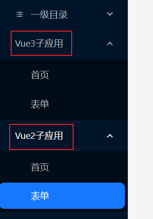

# 简介

SPA + 微前端，可用于练习或者作为项目模板：

```bash
# 代码结构
apps
  |- admin-antd5 # 使用 react18 + antDesign5 + react-router6 + react-redux
  |- admin-element-plus # 使用 vue3 + element-plus + vue-router4 + Pinia
  |- admin-element-ui # 使用 vue2 + element-ui + vue-router3 + Pinia
```

## 启动

```bash
pnpm i # 安装依赖
pnpm run dev # 运行三个 admin 应用
```

## 子应用说明

每个 admin 应用即可作为主应用，也可作为子应用：

| 包名               | 应用名称 | 端口 |
| ------------------ | -------- | ---- |
| admin-element-plus | v3       | 3030 |
| admin-element-ui   | v2       | 3031 |
| admin-antd5        | rc18     | 3032 |


